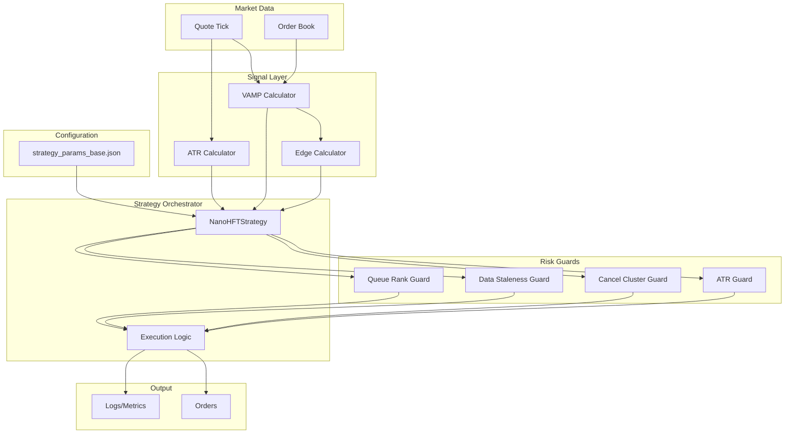
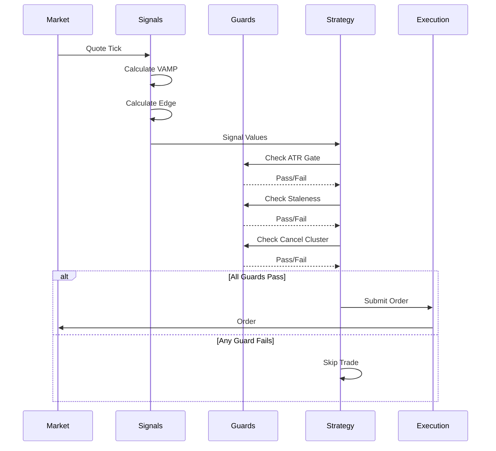

# NanoHFT Architecture Diagram

## System Architecture

## Data Flow Sequence

## Component Responsibilities

### Signal Calculators
- **Input**: Market data (quotes, order book)
- **Processing**: Mathematical calculations
- **Output**: Signal values (VAMP, edge, volatility)

### Risk Guards
- **Input**: Signal values, market conditions
- **Processing**: Risk rule evaluation
- **Output**: Binary decision (allow/block)

### Strategy Orchestrator
- **Input**: Signals, configuration
- **Processing**: Coordinate components, timing
- **Output**: Trading decisions

## Performance Optimization Points

The modular architecture identifies clear optimization targets:

1. **Hot Path** (highest frequency):
   - VAMP calculation
   - Edge calculation
   - Basic guard checks

2. **Warm Path** (medium frequency):
   - ATR updates
   - Queue rank estimation

3. **Cold Path** (low frequency):
   - Configuration loading
   - Logging/metrics